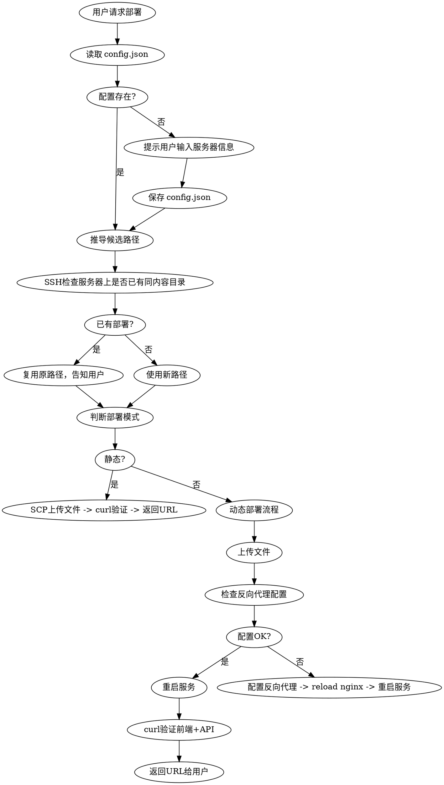

# 部署网页到服务器

## 概述

通过免密SSH + SCP 将网页（静态或动态）部署到远程Web服务器。重新部署时自动在服务器上检查是否已有同内容部署，复用原路径。支持两种部署模式：

- **静态部署**：纯前端文件（HTML/CSS/JS），通过 nginx 直接托管
- **动态部署**：含后端服务的项目（如 Python Flask），需要上传文件 + 配置反向代理 + 管理服务进程

## 适用场景

- 用户说"部署这个"、"发布这个页面"、"上传到服务器"、"deploy"
- 需要将HTML文件通过URL访问
- 需要部署带后端API的Web应用

## 不适用场景

- 需要构建步骤的应用（应使用CI/CD）
- 部署到 Vercel/Netlify 等平台
- 文件包含密钥或凭据（配置文件中的密码等敏感字段不应上传，或需确认后上传）

## 判断部署模式

检查待部署文件的内容，自动判断模式：

| 判断依据 | 部署模式 |
|----------|----------|
| 仅 HTML/CSS/JS/图片等静态文件 | 静态部署 |
| 包含 Python/Node 等服务端脚本 | 动态部署 |
| 前端页面调用了 `/api/` 等后端接口 | 动态部署 |
| 用户明确说明"带后端"、"有API" | 动态部署 |

不确定时，询问用户。

## 配置

配置文件位于 `.claude/skills/deploy-web/config.json`。若不存在，首次使用时提示用户创建。

```json
{
  "servers": [
    {
      "name": "<服务器别名>",
      "host": "<服务器主机名或IP>",
      "user": "<SSH用户名>",
      "webRoot": "<服务器上的Web根目录>",
      "urlTemplate": "https://<域名>/{path}"
    }
  ],
  "defaultServer": "<默认服务器别名>"
}
```

`urlTemplate` 中的 `{path}` 会在部署时替换为实际路径，生成最终访问URL。可配置多个服务器，`defaultServer` 指定未明确目标时使用的服务器。

**安全要求：** 配置中不存放任何密码。必须预先配置好免密SSH（基于密钥认证）。

## 速查表

### 静态部署

| 操作 | 命令 |
|------|------|
| 上传单文件 | `scp <文件> <用户>@<主机>:<webRoot>/<路径>/index.html` |
| 上传目录 | `scp -r <目录>/* <用户>@<主机>:<webRoot>/<路径>/` |
| 验证 | `ssh <用户>@<主机> "curl -sI <url>"` |

### 动态部署

| 操作 | 命令 |
|------|------|
| 创建目录 | `ssh <用户>@<主机> "mkdir -p <webRoot>/<路径>"` |
| 上传所有文件 | `scp <文件1> <文件2> ... <用户>@<主机>:<webRoot>/<路径>/` |
| 检查服务 | `ssh <用户>@<主机> "systemctl status <服务名> --no-pager"` |
| 重启服务 | `ssh <用户>@<主机> "systemctl restart <服务名>"` |
| 查看nginx配置 | `ssh <用户>@<主机> "cat /etc/nginx/conf.d/<配置文件>"` |

## 部署流程



## 实施步骤

### 第1步：加载配置

读取 `.claude/skills/deploy-web/config.json`。若不存在，询问用户：
- 服务器主机名
- SSH用户名
- 服务器上的Web根目录
- 访问部署文件的基础URL模板

然后保存为 config.json。

### 第2步：确定部署路径（检查是否已部署）

先推导候选路径，然后通过 SSH 检查服务器上是否已有同名目录或内容相似的部署：

```bash
# 列出 webRoot 下的现有目录，查找与候选路径匹配的部署
ssh <用户>@<主机> "ls <webRoot>/ | grep -i '<关键词>'"

# 检查候选路径是否已存在
ssh <用户>@<主机> "ls -la <webRoot>/<候选路径>/"
```

匹配规则：
- **路径名匹配**：服务器上已有与推导路径同名的目录（如推导路径为 `project-report/`，服务器上已有 `<webRoot>/project-report/`）
- **内容匹配**：目录内已有 `index.html` 或与当前待部署文件同名的文件

如果服务器上已有匹配的部署：
- **复用原路径**，告知用户"该内容已部署于 `<已有路径>`，将更新部署"
- 直接覆盖上传，无需创建新目录

如果没有匹配的部署：
- 按路径推导规则使用新路径

如果用户指定了路径，始终使用用户指定的路径，但同样检查服务器上是否已存在该目录（复用目录，覆盖内容）。

### 第3步：执行部署

#### 静态部署

```bash
# 创建目标目录
ssh <用户>@<主机> "mkdir -p <webRoot>/<路径>"

# 上传单文件
scp <本地文件> <用户>@<主机>:<webRoot>/<路径>/index.html

# 上传目录
scp -r <本地目录>/* <用户>@<主机>:<webRoot>/<路径>/
```

#### 动态部署

动态部署比静态多三个环节：文件上传、反向代理配置、服务管理。

**3a. 上传所有文件**

```bash
# 创建目标目录
ssh <用户>@<主机> "mkdir -p <webRoot>/<路径>"

# 上传所有项目文件（前端+后端+配置）
scp <文件1> <文件2> ... <用户>@<主机>:<webRoot>/<路径>/
```

上传前检查：排除含密钥/凭据的文件，或确认用户是否需要上传。配置文件（如 JSON 配置）中可能包含密码，需确认后再上传。

**3b. 检查反向代理配置**

动态部署需要 nginx 反向代理将 API 请求转发到后端服务。检查服务器上是否已有对应配置：

```bash
ssh <用户>@<主机> "cat /etc/nginx/conf.d/*.conf"
```

如果已有配置且路径/端口匹配当前部署，跳过配置步骤。如果缺少配置，需要添加反向代理规则，关键配置项：

```nginx
# API 反向代理 — 将 <部署路径>/api/ 转发到后端服务端口
location <部署路径>/api/ {
    proxy_pass http://127.0.0.1:<后端端口>/api/;
    proxy_set_header Host $host;
    proxy_set_header X-Real-IP $remote_addr;
    proxy_set_header X-Forwarded-For $proxy_add_x_forwarded_for;
    proxy_set_header X-Forwarded-Proto $scheme;
}

# 前端页面 — 静态托管
location <部署路径>/ {
    try_files $uri $uri/ <部署路径>/index.html;
}
```

添加配置后 reload nginx：

```bash
ssh <用户>@<主机> "nginx -t && systemctl reload nginx"
```

**3c. 服务管理**

后端服务需要作为 systemd 服务运行。检查是否已有服务配置：

```bash
ssh <用户>@<主机> "cat /etc/systemd/system/<服务名>.service"
```

如果没有，需要创建 systemd service 文件。关键配置项：

```ini
[Unit]
Description=<服务描述>
After=network.target

[Service]
Type=simple
User=root
WorkingDirectory=<webRoot>/<部署路径>
ExecStart=<启动命令>  # 如: /usr/bin/python3 -m gunicorn --bind 127.0.0.1:<端口> --workers 2 --timeout 60 <入口模块>:app
Restart=always
RestartSec=5

[Install]
WantedBy=multi-user.target
```

创建后启用并启动：

```bash
ssh <用户>@<主机> "systemctl daemon-reload && systemctl enable <服务名> && systemctl start <服务名>"
```

文件更新后重启服务：

```bash
ssh <用户>@<主机> "systemctl restart <服务名>"
```

### 第4步：验证

#### 静态部署验证

```bash
ssh <用户>@<主机> "curl -sI <url> | head -3"
```

必须返回 HTTP 200。

#### 动态部署验证

分别验证前端和后端 API：

```bash
# 验证前端页面
ssh <用户>@<主机> "curl -sI <前端URL> | head -3"

# 验证后端 API
ssh <用户>@<主机> "curl -s <API URL> | head -5"
```

前端必须 HTTP 200，API 必须返回有效 JSON。两项均通过才算部署成功。

### 第5步：返回URL

将 `urlTemplate` 中的 `{path}` 替换为实际路径，向用户返回完整URL。动态部署同时告知用户后端服务状态。

## 路径推导规则

| 输入 | 部署路径 | 访问URL |
|------|---------|---------|
| `项目汇报.html` | `project-report/index.html` | `<baseUrl>/project-report/` |
| `report.html` | `report/index.html` | `<baseUrl>/report/` |
| `my-site/` 目录 | `my-site/` | `<baseUrl>/my-site/` |
| 用户指定路径 | 按用户指定 | 基于指定路径 |

当文件名为中文或非ASCII字符时，翻译/音译为干净的英文路径。不确定时询问用户。

## 常见错误

- 忘记远程 `mkdir -p` — 目录不存在时 SCP 会失败
- 上传到错误的 webRoot — 始终读取配置，不要猜测
- 未用 curl 验证 — 静默失败很常见
- URL中包含 `.html` — 部署为 `index.html` 可获得简洁URL
- 部署含密钥的文件 — 部署前务必检查配置文件中的密码、令牌
- 动态部署忘记配置反向代理 — API 请求无法到达后端
- 动态部署忘记重启服务 — 更新代码后旧进程仍在运行
- 动态部署服务端口冲突 — 检查 `ss -tlnp` 确认端口未被占用

## 清理

删除已部署的路径：

```bash
# 删除静态文件
ssh <用户>@<主机> "rm -rf <webRoot>/<路径>"

# 动态部署还需停止并删除服务
ssh <用户>@<主机> "systemctl stop <服务名> && systemctl disable <服务名> && rm /etc/systemd/system/<服务名>.service && systemctl daemon-reload"
```

删除前必须与用户确认。